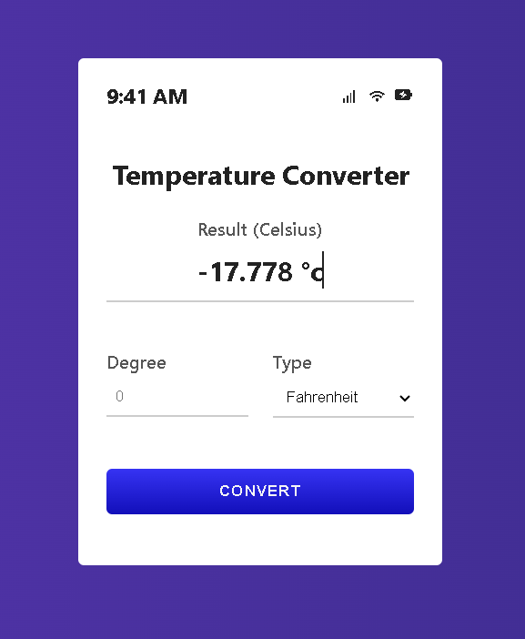

# 🌡️ TempConverter

A sleek and intuitive temperature converter tool built as part of my portfolio.  
This project demonstrates a simple, user-friendly interface for converting temperatures between Celsius, Fahrenheit, and Kelvin.

---

## 🔗 Live Demo  
*(If deployed via GitHub Pages or similar, add link here)*  
[View Live Demo](https://salilbhojankar1.github.io/TempConverter/)

---

## 📸 Screenshots

### Converter Interface
  
*(Replace with a real screenshot of your app interface)*

---

## 🛠️ Tech Stack & Tools

- **HTML5** – Markup  
- **CSS3** – Styling & responsive layout  
- **JavaScript** – Conversion logic & DOM manipulation  

---

## 🎯 Features

- ✅ Convert between Celsius, Fahrenheit & Kelvin  
- ✅ Instant real-time conversion  
- ✅ Clear UI with minimal design  
- ✅ Input validation and error handling  
- ✅ Responsive layout so it works on mobile & desktop  

---

## 📂 Project Structure

TempConverter/
│
├── index.html # Main HTML page
├── style.css # Stylesheet
├── script.js # Conversion logic & DOM interaction
├── images/ # Screenshots, icons, etc.
└── README.md # This file

---

## 🚀 Getting Started

1. Clone the repository:  
   ```bash
   git clone https://github.com/salilbhojankar1/TempConverter.git

---

## 👨‍💻 Author

Salil Bhojankar

Portfolio: salilbhojankar1.github.io

GitHub: @salilbhojankar1

LinkedIn: [(Salil Bhojabkar)](https://www.linkedin.com/in/salil-bhojankar-ab12ab238)

---

## 📜 License

This project is licensed under the MIT License – free to use, modify, and share.
